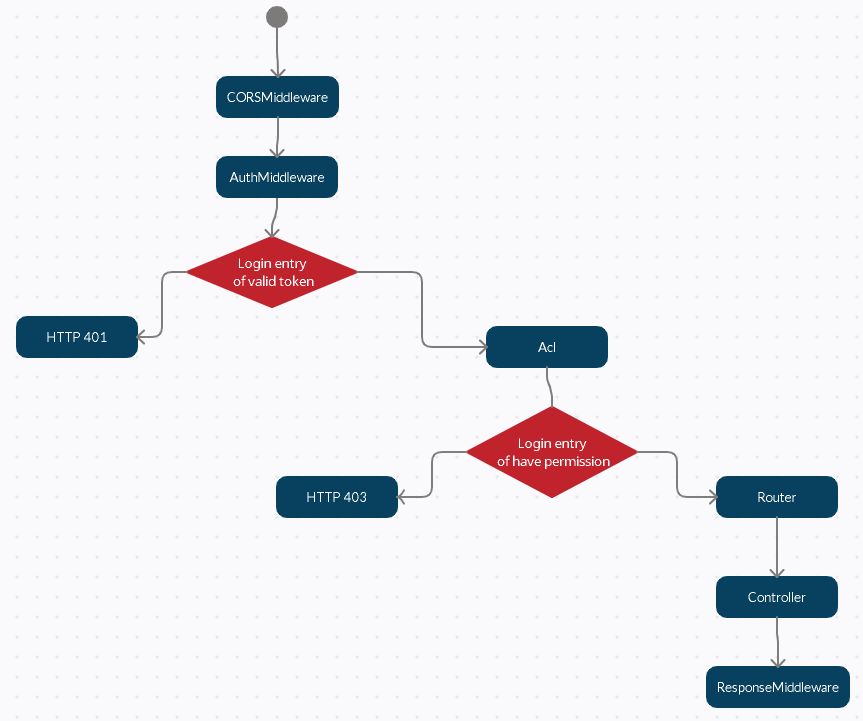

# DTT Project
Through this test, I should demonstrate that I'm capable to contribute to DTT and her clients on a professional level.

This is an API REST maked with Phalcon 4.1

## Table of Content
- [DTT Project](#dtt-project)
  - [Table of Content](#table-of-content)
  - [File Structure](#file-structure)
  - [API Cycle](#api-cycle)

## File Structure
+-- devops
+-- dump
+-- src
|    +-- app
|    |   +-- config
|    |   +-- controllers
|    |   +-- helpers
|    |   +-- middleware
|    |   +-- migrations
|    |   +-- models
|    |   +-- modules
|    |   +-- modules
|    |   +-- services
|    +-- public
|    +-- vendor

## API Cycle
